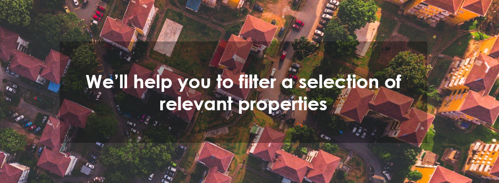
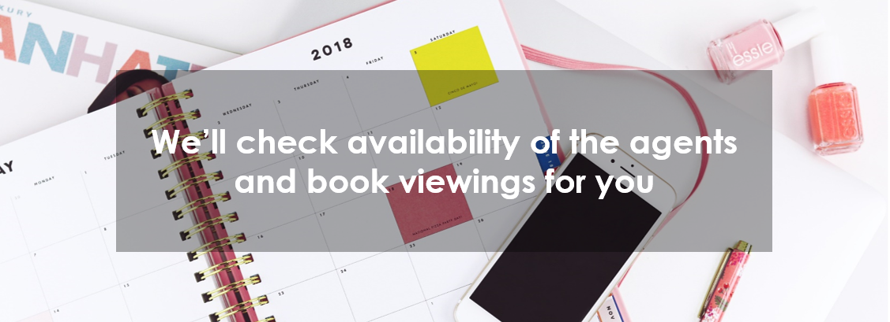

# Welcome to the MoveMe community!

## You are about to move and you want to enjoy a seamless and interactive experience? MoveMe helps you find the most relevant accommodation you are looking for. 

### We will help you:

### -	filter the selection of the homes
### -	show places based on your feedback
### -	check availability of the agents and book viewings automatically
 

 

### Let us know what you are looking for. Do not worry if you are not inspired, we will help you make up your mind! 

### The more you provide feedback, the better our suggestions will be!

 

### Do you want to book a viewing?  No problem! Share your availabilities we will contact you!

### Chat with MoveMe!

<!-- Start of BotEngine (www.botengine.ai) code -->

<!-- End of BotEngine code -->

<iframe src="https://calendar.google.com/calendar/embed?title=My%20viewing%20calendar&amp;height=600&amp;wkst=1&amp;bgcolor=%2300cccc&amp;src=nn.buisson%40gmail.com&amp;color=%231B887A&amp;ctz=Europe%2FLondon" style="border-width:0" width="600" height="400" frameborder="0" scrolling="no"></iframe>

 

<h2 class="w3-center">Manual Slideshow</h2>

  
  
  

  <button class="w3-button w3-black w3-display-left" onclick="plusDivs(-1)">&#10094;</button>
  <button class="w3-button w3-black w3-display-right" onclick="plusDivs(1)">&#10095;</button>

