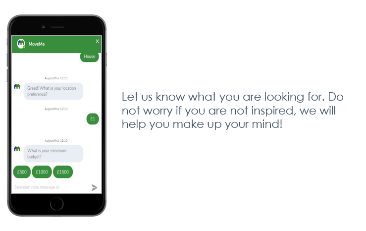
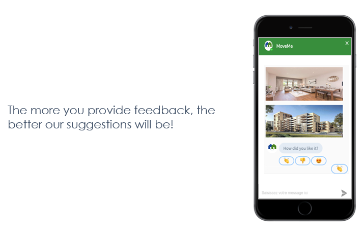
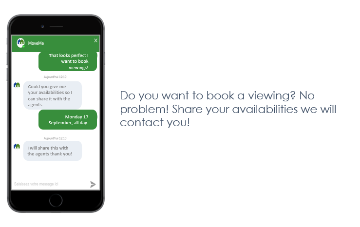
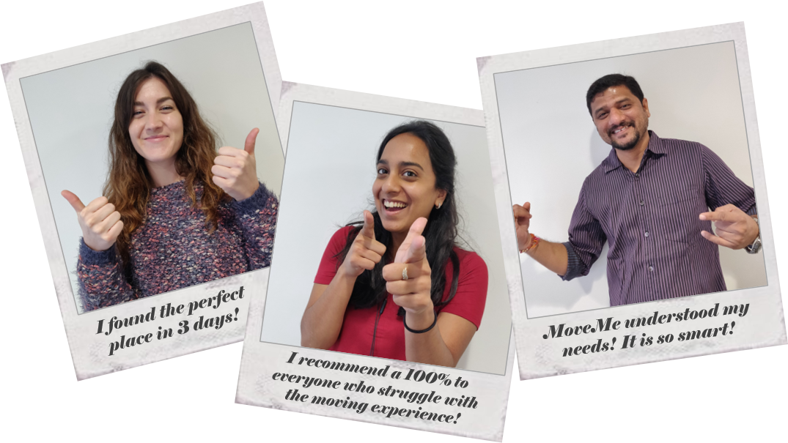

<h2 class="w3-center"></h2>

  
  
  

## You are about to move and you want to enjoy a seamless and interactive experience? MoveMe helps you find the most relevant accommodation you are looking for. 

 

### The more you provide feedback, the better our suggestions will be!

 

### Do you want to book a viewing?  No problem! Share your availabilities we will contact you!

### Our clients speak for ur!

 

<!-- Start of BotEngine (www.botengine.ai) code -->

<!-- End of BotEngine code -->

<iframe src="https://calendar.google.com/calendar/embed?title=My%20viewing%20calendar&amp;height=600&amp;wkst=1&amp;bgcolor=%2300cccc&amp;src=nn.buisson%40gmail.com&amp;color=%231B887A&amp;ctz=Europe%2FLondon" style="border-width:0" width="600" height="400" frameborder="0" scrolling="no"></iframe>

<a href="https://twitter.com/intent/tweet?button_hashtag=MoveMe&ref_src=twsrc%5Etfw" class="twitter-hashtag-button" data-show-count="false">Tweet #MoveMe</a>

 

